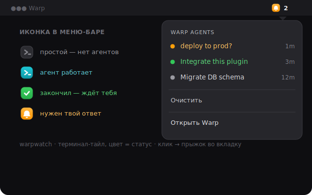

# warpwatch

**A macOS menu-bar dashboard of your [Claude Code](https://docs.claude.com/en/docs/claude-code) agents running in [Warp](https://www.warp.dev/).**

   

One row per Warp tab, named after its task, with a live status. The menu-bar icon is the **Warp logo on a status-coloured tile** (crisp vector SVG) — **teal** while an agent is working, **amber** the moment a tab stops and it's your turn — click it to jump straight to the **exact** tab the agent is in.



---

## Why

You run several agents across several Warp tabs and step away. With normal notifications you get a pile of banners, and clicking one drops you on whatever tab is active. warpwatch instead gives you a glanceable dashboard:

- **per tab, not per event** — each Warp tab is one row, labelled by its task (taken from your prompt);
- **two states that matter** — `⏳ working` (agent busy) and `💬 waiting` (it stopped — your turn, whether it finished or asked a question);
- **one clear signal** — the menu-bar icon is teal while agents work and turns amber the moment a tab is waiting for you;
- **jump to the right tab** — every Warp tab exports `warp://session/<uuid>` in `$WARP_FOCUS_URL`; the hook runs inside the tab, records that link, and clicking the row runs `open warp://session/<uuid>` — the **exact** tab, never "the last one".

The menu-bar path is **immune to Do Not Disturb, Focus and per-app Alert-Style settings** — the things that quietly swallow normal banners. The finish sound goes through `afplay`, which also bypasses Do Not Disturb.

> Requires **macOS** + **Warp**. Tab focusing falls back to "activate Warp" if `$WARP_FOCUS_URL` isn't present.

---

## Install

```bash
git clone https://github.com/gzaripov/warpwatch.git ~/.claude/warpwatch
~/.claude/warpwatch/install.sh
```

### 1. Hooks

Merge into `~/.claude/settings.json` (keep any existing `hooks`):

```json
{
  "hooks": {
    "UserPromptSubmit": [ { "hooks": [ { "type": "command", "command": "\"$HOME/.claude/warpwatch/scripts/notify.sh\" start", "timeout": 10 } ] } ],
    "Stop":             [ { "hooks": [ { "type": "command", "command": "\"$HOME/.claude/warpwatch/scripts/notify.sh\" done",  "timeout": 10 } ] } ],
    "Notification":     [ { "hooks": [ { "type": "command", "command": "\"$HOME/.claude/warpwatch/scripts/notify.sh\" input", "timeout": 10 } ] } ],
    "SessionEnd":       [ { "hooks": [ { "type": "command", "command": "\"$HOME/.claude/warpwatch/scripts/notify.sh\" end",   "timeout": 10 } ] } ]
  }
}
```

| Hook | Action | Tab becomes |
|------|--------|-------------|
| `UserPromptSubmit` | `start` | **⏳ working** (and named after your prompt) |
| `Stop` | `done` | **💬 waiting** — the agent finished its turn, your move |
| `Notification` | `input` | **💬 waiting** — the agent is asking you / needs a permission |
| `SessionEnd` | `end` | removed from the dashboard |

The folder is also a valid Claude Code plugin (`.claude-plugin/plugin.json` + `hooks/hooks.json`), so you can wire it through `/plugin` instead.

### 2. Menu-bar item (SwiftBar)

```bash
brew install --cask swiftbar
defaults write com.ameba.SwiftBar PluginDirectory "$HOME/.claude/warpwatch/swiftbar"
open -a SwiftBar
```

### 3. (optional) Clickable corner notifications

```bash
brew install terminal-notifier   # only used in WARPWATCH_MODE=notification
```

---

## Using it

- **Glance at the menu bar.** Teal = agents working. Amber + a number = that many tabs are waiting for you.
- **Open the dropdown.** Waiting tabs (💬) sort above working ones (⏳), each with its name and how long ago it changed.
- **Click a tab** → jumps to that exact Warp tab. It stays "waiting" until you actually send it a prompt (then it's working again).
- **Очистить** wipes the dashboard.

## Modes

`WARPWATCH_MODE` controls what happens *in addition* to the dashboard when a tab finishes (set it in the `env` block of `settings.json`):

| Mode | On finish |
|------|-----------|
| `menubar` *(default)* | dashboard + sound only |
| `notification` | + corner banner (tab-aware click with terminal-notifier) |
| `dialog` | + persistent centre-screen overlay (immune to DND) |
| `focus` | + jump straight to the tab |
| `both` | + dialog and focus |
| `silent` | dashboard only, no sound |

## Environment variables

| Var | Default | Meaning |
|-----|---------|---------|
| `WARPWATCH_MODE` | `menubar` | see above |
| `WARPWATCH_ALWAYS` | `0` | `1` = act even when Warp is already frontmost |
| `WARPWATCH_SOUND_DONE` | `…/Hero.aiff` | sound for "finished" |
| `WARPWATCH_SOUND_INPUT` | `…/Glass.aiff` | sound for "needs input" |
| `WARPWATCH_DIALOG_GIVEUP` | `86400` | auto-dismiss the dialog after N seconds |
| `WARPWATCH_APP` | `Warp` | app to focus when no per-tab URL is available |
| `WARPWATCH_STATE` | `~/.claude/warpwatch/state` | where the dashboard is stored |

warpwatch stays quiet while you're already looking at Warp (it compares the frontmost app's **bundle id** to Warp's — Warp Stable's *process* name is `stable`, so a name check would never match). `WARPWATCH_ALWAYS=1` overrides this.

---

## How it works

```
Claude Code hooks (run inside the agent's Warp tab)
   UserPromptSubmit → notify.sh start   tab → working   (name = your prompt)
   Stop             → notify.sh done     tab → finished  + sound
   Notification     → notify.sh input    tab → needs-input + sound
   SessionEnd       → notify.sh end      tab → removed
        │  upserts one row per tab, keyed by $WARP_TERMINAL_SESSION_UUID
        ▼
   state/tabs.tsv   uuid ⇥ status ⇥ epoch ⇥ name ⇥ cwd ⇥ warp://session/uuid
        ▼
swiftbar/warpwatch.5s.sh  → menu-bar item (grey / bright) + per-tab dropdown
        └─ click a row → open warp://session/<uuid> → the exact tab
```

## Files

```
warpwatch/
├── .claude-plugin/plugin.json   plugin manifest
├── hooks/hooks.json             plugin-style hooks (${CLAUDE_PLUGIN_ROOT})
├── scripts/
│   ├── notify.sh                the hook: per-tab state machine + sound + popup
│   ├── dialog.applescript       persistent, tab-aware centre dialog
│   ├── menubar-open.sh          open a tab + clear its highlight
│   └── menubar-clear.sh         wipe the dashboard
├── swiftbar/warpwatch.5s.sh     SwiftBar menu-bar dashboard
├── docs/menubar.svg             the preview above
├── install.sh                   one-shot setup helper
└── README.md
```

## License

MIT © Grigory Zaripov
